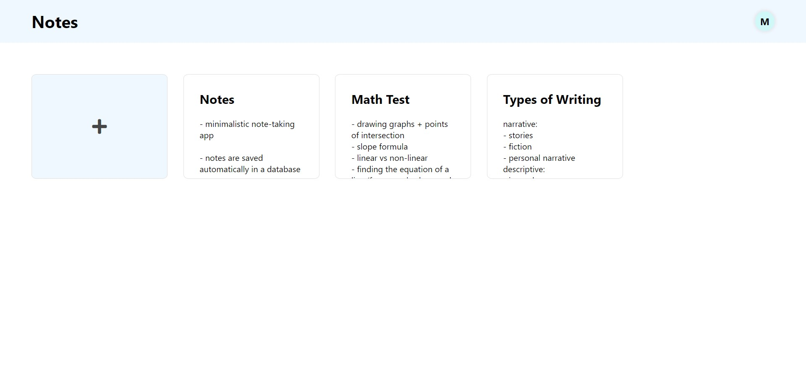

# Notes

Notes is inspired by Google Keep, with a focus on a simple and easy-to-use interface.

You can try the app here: https://notesapp0011.herokuapp.com/

&nbsp;


## Technical info

The backend was built with Flask/Python and user logins were implemented using Google OAuth. The app is connected to a PostgreSQL database, which stores the users and notes.

The user interface is built with HTML and CSS and the responsive grid layout for notes was made using CSS Grid.

I used jQuery to make calls to the backend for saving and updating notes, and Javascript to add interactive components such as modals and option menus to the ui.

The application is deployed on Heroku and uses the PostgreSQL add-on.

## Run the app locally

Make sure you have Python and PostgreSQL installed.

1. Create a PostgreSQL database

2. Create a project in the [Google API Console](https://console.developers.google.com/)

3. Create an OAuth client ID, adding `http://127.0.0.1:5000` under Authorised JavaScript origins and `http://127.0.0.1:5000/authorized` as an authorised redirect URI

Create a `.env` file with the following secrets:

```
SECRET_KEY=
GOOGLE_CLIENT_ID=
GOOGLE_CLIENT_SECRET=
DATABASE_URL=
TESTING=True
```

When adding the url for the PostgreSQL database, use `postgres://` instead of `postgresql://`, as the app will automatically change it during configuration, due to conflicts with the database url given by Heroku.

Follow the steps below to install the dependencies in a virtual environment and run the project.

1. `python3 -m venv venv`

2. `source venv/bin/activate`

3. `pip install -r requirements.txt`

4. `flask run`

On a Windows computer, you should use the following commands to set up the virtual environment:

1. `python -m venv venv`

2. `venv\scripts\activate`
